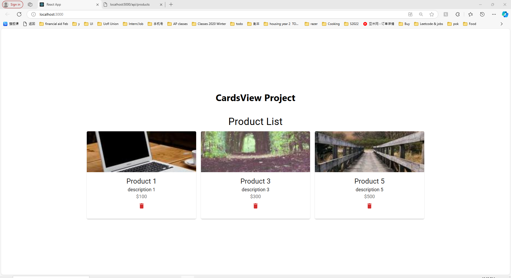

Overview
This application displays a list of products in card format, allowing users to view details and delete cards as needed.
Tech Stack
Frontend: React
Backend: Node.js, Express.js

Getting Started
To set up and launch both the backend and frontend, follow these three steps:

# 1. Clone the repository

git clone the project

# 2. Backend Setup

Backend code needs expressand cors as well, so navigate to the backend directory in your terminal and run:

cd ProjectName
cd backend
npm install express cors
npm start

(Optional) Verify the Backend Server:
Once the backend is running, you can test it by visiting http://localhost:5000/api/products in a browser or API

Backend server will run on http://localhost:5000

# 3. Frontend Setup

Similar to backend,

Steps:
cd ProjectName
cd frontend
npm install
npm start

Frontend server will run on http://localhost:3000

CardsView Project Display

Potential Fixes:

Make sure to use cd command to path to the right files. Check namings!
Make sure you install required things before launching, like express for backend.
